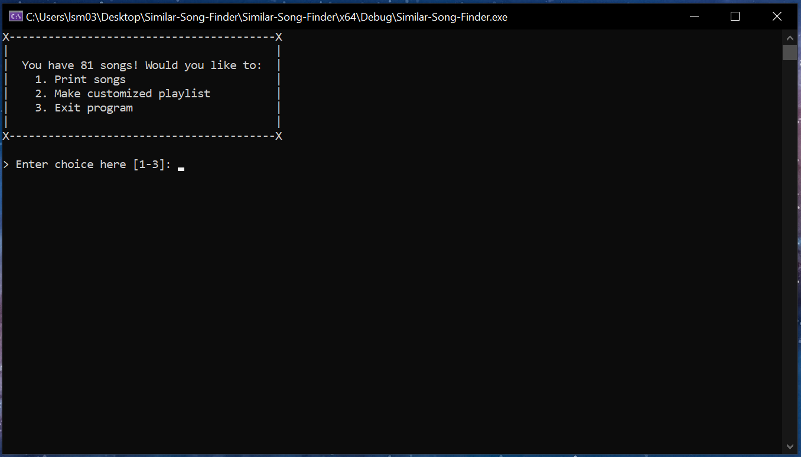

# Similar-Song-Finder

A simple music sorter, based on your preferences in C! Uses a small test batch of music, but this program could be expanded a lot in the future.

## Table of Contents

- [First, some info](#first-some-info)
  - Overall info for our project
- [Program Inspiration](#program-inspiration)
  - Initial Idea
  - Problem being solved
  - Our special touches
- [How to run](#how-to-run)
  - Programs/Tools needed
  - How to run
- [The Program Running]()
- [Program Layout](#program-layout)
  - What each file does/is reponsible for
- [Future Improvements](#future-improvements)
  - Ideas from ourselves
  - Ideas from mentors

## First, some info:
- **Programmers (w/ GitHub links):**
  - [Mason Nagel](https://github.com/MasonNagel5)
  - [Grayson Fougere](https://github.com/TheChromeBookGod)
  - [Logan Meyers](https://github.com/TheTerrarian03)
- **Event:**
  - *Crimson Code Hackathon 2025*
- **Theme:**
  - Prompt: *"Art in Innovation"*
  - We chose music as our form of art, something we all experience daily
- **Programming Language:**
  - **C**
  - Since we've been using C in CPT_S 121 & 122
  - Something we're familiar with but can still challenge ourselves with

## Program Inspiration
We found it a little tough at first to figure out exactly what something we all could benefit from a program, solving a problem we have with art. But after some brainstorming, we thought about music. Our pitch:

*You know how when listening to Spotify, Tidal, Apple Music, etc, they show you similar songs to the one you're listening to? Like the "Radio" or "Suggested Tracks" feature? What if it was better?*

All of our team member have wanted a better radio feature, which would sort the songs based on how similar they are to the one we're listening to right now. But it's almost guaranteed every other radio feature does that same thing. So how could we make it different?

We thought it would be very nice to be able to adds *weights*, or *preferences*, to certain aspects of songs such as artist, genere, word count, happy/sad, etc, where songs that match those categories you chose to prefer would be weighed higher in the scoring for how similar they are.

## How to Run

This project uses the same programs and tools as CPT_S 121 & 122, so you'll need to:
1. Clone the repository
2. Download and/or launch Visual Studio 2022 with the `Desktop development with C++` package installed
3. Open the Solution file at [`./Similar-Song-Finder/Similar-Song-Finder.sln`](.\Similar-Song-Finder\Similar-Song-Finder.sln)
4. Run the project! Click the funny triangle

## The Program Running

Here are some screenshots

> The Welcome Screen!

> The Main Menu! You have 3 options... choose wisely...

> Example input getting for choosing preferences

> Example Output for sorted songs, with the lowest on the list being least similar

## Program Layout

Here is a very simplified description of what files are responsible for what in our program:

- [`main.c`](./Similar-Song-Finder/main.c): The main entry point of the program, the main user input loop.
- [`similar_song_finder.c`](./Similar-Song-Finder/similar_song_finder.c) & [`.h`](./Similar-Song-Finder/similar_song_finder.h): Handles the high-level getting of user preferences, initial song, and song scoring.
- [`list.c`](./Similar-Song-Finder/list.c) & [`.h`](./Similar-Song-Finder/list.h): Provides structs and functions for the **doubly-linked-list** we're using to store the songs. Also includes loading from a file.
- [`ui.c`](./Similar-Song-Finder/ui.c) & [`.h`](./Similar-Song-Finder/ui.h): Provides abstracted menu functions for some simple CLI UI and input verification loops.

## Future Improvements

While working on our project, we talked to a mentor and they gave us some ideas we agree with, and we also came up with a few of our own! Here's what we're thinking for the future, should we wish to continue working on this.

- **A better weights system**
  - Currently, the weights are pretty **linear**, a 1-or-0 kind of thing. We think it would be good to expand the scoring and sorting to have a more **gradual scale** of certain things, like genre, bpm, and word count.
  - For example, adding more to the similarity score if a particular song is closer in genre vs it being further away (e.x. pop vs hip-hop is pretty close, high score; e.x. pop vs metal is pretty far apart, lower score).
  - Another example, if the user wants to prefer songs with similar word count, change the score based on how close it is, rather than a simple true/false range
- **Progressive Selection**
  - Currently, we ask for the user's initial song to base the playlist on, then what hey prefer. We think it would be helpful to include and option to let the user:
    - accept/deny songs to be added next
    - change the song they want to compare other songs against in the middle of the playlist sorting
    - change preferences in the middle of playlist sorting
  - This adds a lot more complexity, but ultimately it boils down to **user choice and flexibility**.
- **An Alternative Mode, Pattern Recognition**
  - We got this while talking to a mentor. It would be cool if there was possibly an alternative mode or option where the user could:
    - choose a bunch of songs they like
    - have the program determine a pattern, or what the user prefers to listen to
    - then make a playlist based on those preferenes/patterns for the user
- **Expanded Music Catalog**
  - The most obvious weak point of this program right now is the small music catalog of 82 songs. It would be really cool to implement some API usage, where we can get songs from some service maybe filtered. One thing the mentor mentioned is using the Spotify API, which would be incredibly cool! Complex, and probably terrible in C, but cool!